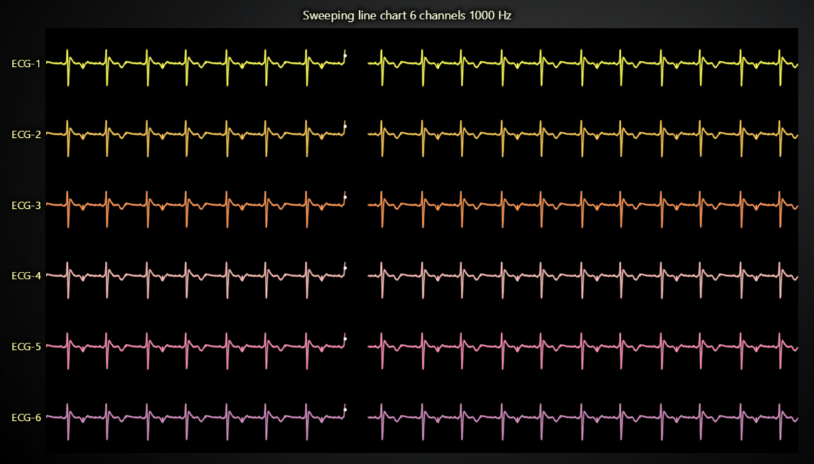

# JavaScript Sweeping Line Chart Dashboard

This demo application belongs to the set of examples for LightningChart JS, data visualization library for JavaScript.

LightningChart JS is entirely GPU accelerated and performance optimized charting library for presenting massive amounts of data. It offers an easy way of creating sophisticated and interactive charts and adding them to your website or web application.

The demo can be used as an example or a seed project. Local execution requires the following steps:

-   Make sure that relevant version of [Node.js](https://nodejs.org/en/download/) is installed
-   Open the project folder in a terminal:

          npm install              # fetches dependencies
          npm start                # builds an application and starts the development server

-   The application is available at _http://localhost:8080_ in your browser, webpack-dev-server provides hot reload functionality.

## Description

This interactive example with the code editor shows a sweeping ECG line chart created with LightningChart JS library. You can experiment with the variables and parameters to see how the library performs using our online code editor.

Sweeping line chart functionality is not built-in in the library. However, it is entirely possible to create performant and visually appealing sweeping line applications with LightningChart JS. Performance is unaffected, but the application code is slightly more complex than the scrolling axis. Some built-in features are also inapplicable, such as real-time axis ticks and glow effects.

This example displays 6 ECG channels, each with a 1000 Hz frequency.

Stress testing has concluded that even 100s of such high-frequency channels can be displayed at the same time. To squeeze more GPU performance out, you can try setting line series thickness to -1 for the best performance.

---

A simplified version of sweeping charts can be found in [this example](https://lightningchart.com/js-charts/interactive-examples/examples/lcjs-example-0041-sweepingLineChartNew.html).

These two examples have slightly different approaches to realizing the sweeping display, each having their own advantages and disadvantages:

A) **This example, "sweeping line dashboard"**

-   Extremely performant, recommended for extremely performance demanding applications with 100+ channels and 10+ kHz stream rates.

*   Relatively complicated application code, having to manage multiple series instances per trend and rectangle overlays to hide old data.
*   Some chart features are not supported, such as: axis ticks, series glow/drop shadow effects, gradient backgrounds.

B) **"sweeping line chart" example**

Found [here](https://lightningchart.com/js-charts/interactive-examples/examples/lcjs-example-0041-sweepingLineChartNew.html)

-   Less performant, works up to 100 channels and 1 kHz stream rate. If less channels can work with higher stream rates too. Just more CPU intensive than the other approach.

*   Very simple to implement and maintain.
*   No limitations to chart features - axis ticks, cursors, effects, backgrounds all work as normally.

## API Links

* [XY cartesian chart]
* [Line series]
* [Axis]

## Support

If you notice an error in the example code, please open an issue on [GitHub][0] repository of the entire example.

Official [API documentation][1] can be found on [LightningChart][2] website.

If the docs and other materials do not solve your problem as well as implementation help is needed, ask on [StackOverflow][3] (tagged lightningchart).

If you think you found a bug in the LightningChart JavaScript library, please contact sales@lightningchart.com.

Direct developer email support can be purchased through a [Support Plan][4] or by contacting sales@lightningchart.com.

[0]: https://github.com/Arction/
[1]: https://lightningchart.com/lightningchart-js-api-documentation/
[2]: https://lightningchart.com
[3]: https://stackoverflow.com/questions/tagged/lightningchart
[4]: https://lightningchart.com/support-services/

© LightningChart Ltd 2009-2022. All rights reserved.

[XY cartesian chart]: https://lightningchart.com/js-charts/api-documentation/v5.1.0/classes/ChartXY.html
[Line series]: https://lightningchart.com/js-charts/api-documentation/v5.1.0/classes/LineSeries.html
[Axis]: https://lightningchart.com/js-charts/api-documentation/v5.1.0/classes/Axis.html

